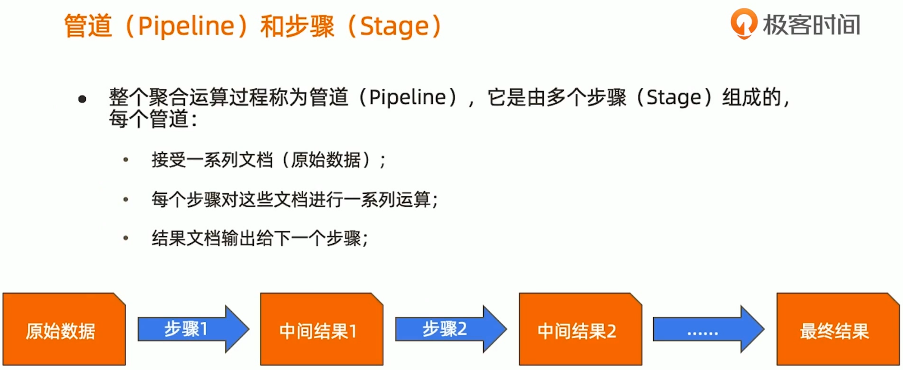
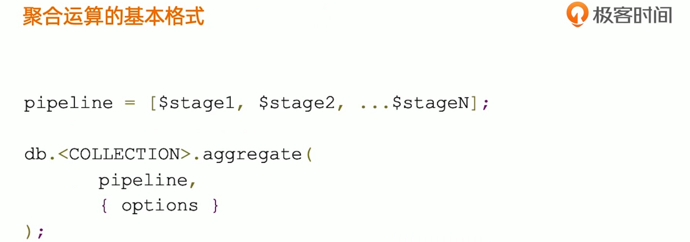
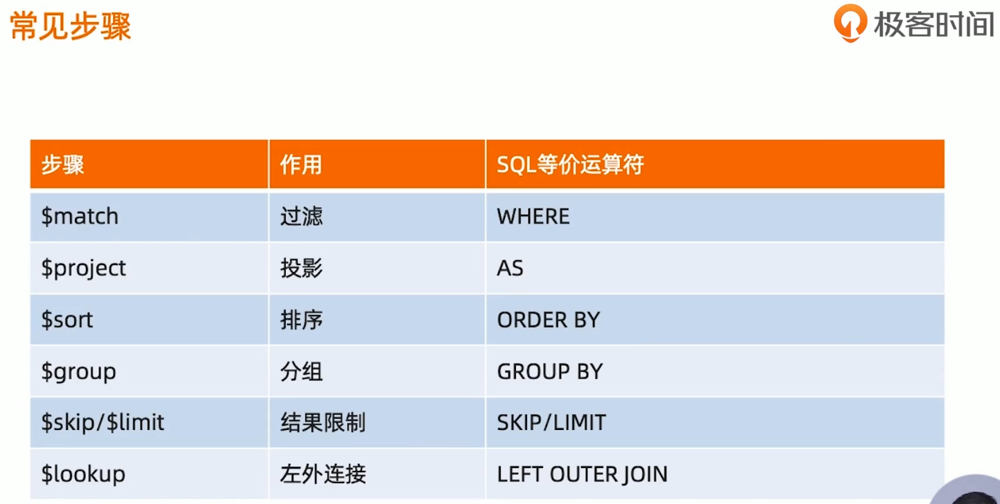
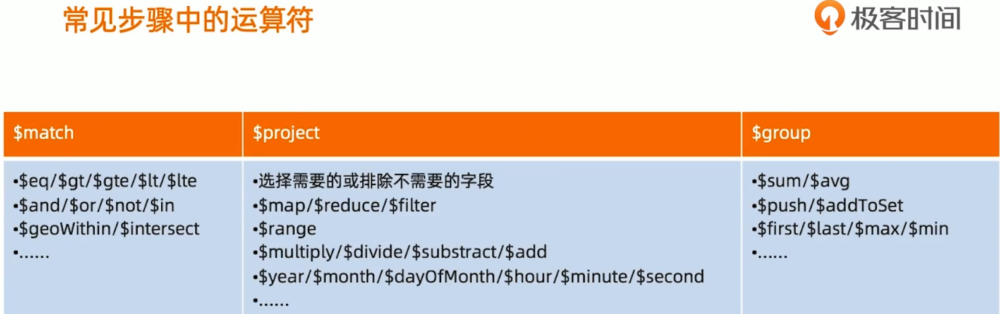
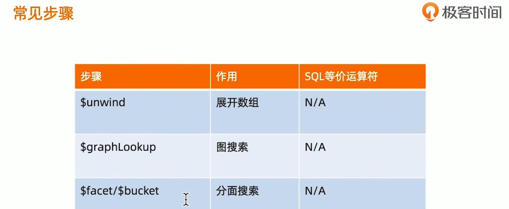
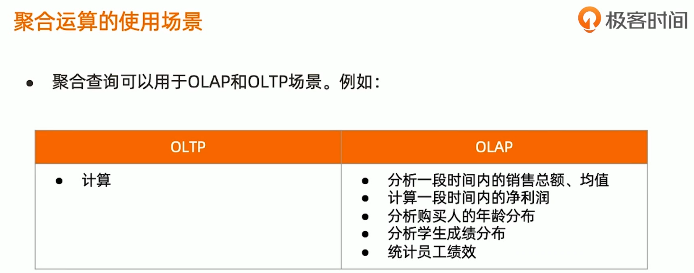
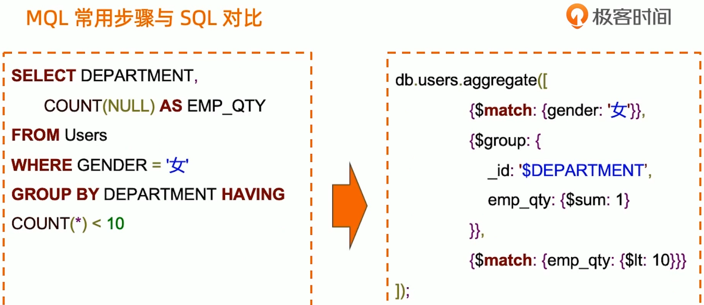

启动 mongo 客户端

./mongo

查看

```Bash
db.comment.find()
```


新增

```Bash
db.comment.insertMany([{"_id":"1","articleid":"100001","content":"我们不应该把清晨浪费在手机上，健康很重要，一杯温水幸福你我他。","userid":"1002","nickname":"相忘于江湖","createdatetime":new Date("2019-08-05T22:08:15.522Z"),"likenum":NumberInt(1000),"state":"1"},{"_id":"2","articleid":"100001","content":"我夏天空腹喝凉开水，冬天喝温开水","userid":"1005","nickname":"伊人憔悴","createdatetime":new Date("2019-08-05T23:58:51.485Z"),"likenum":NumberInt(888),"state":"1"},{"_id":"3","articleid":"100001","content":"我一直喝凉开水，冬天夏天都喝。","userid":"1004","nickname":"杰克船长","createdatetime":new Date("2019-08-06T01:05:06.321Z"),"likenum":NumberInt(666),"state":"1"},{"_id":"4","articleid":"100001","content":"专家说不能空腹吃饭，影响健康。","userid":"1003","nickname":"凯撒","createdatetime":new Date("2019-08-06T08:18:35.288Z"),"likenum":NumberInt(2000),"state":"1"},{"_id":"5","articleid":"100001","content":"研究表明，刚烧开的水千万不能喝，因为烫嘴。","userid":"1003","nickname":"凯撒","createdatetime":new Date("2019-08-06T11:01:02.521Z"),"likenum":NumberInt(3000),"state":"1"}]);
```


















