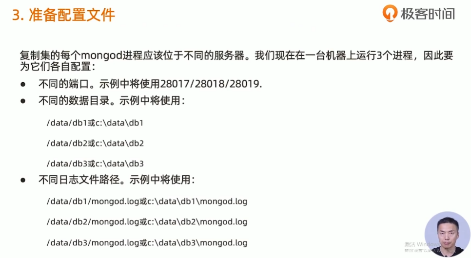
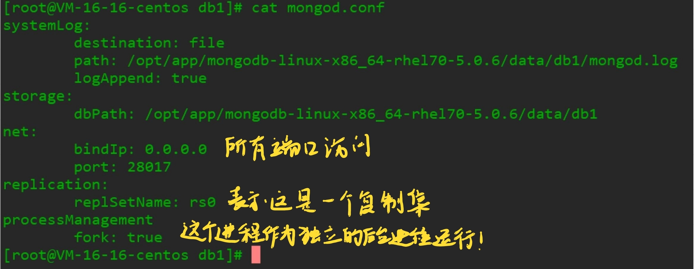

# mongo复制集

---

## 典型复制集结构

一个典型的复制集由3个以上具有投票权的节点组成,包括:

- 一个主节点(PRIMARY):接受写入操作和选举时投票
- 两个(或多个)从节点(SECONDARY): 复制主节点上的新数据和选举时投票
- 不推荐使用Arbiter(投票节点)


## 数据如何复制的

- 当一个修改操作,无论是插入,更新或删除,到达主节点时,它对数据的操作将被记录下来(经过一些必要的转换),这些记录称为oplog.
- 从节点通过在主节点上打开一个tailable游标不断获取新进入主节点的oplog,并在自己的数据上回放,从此保持跟主节点的数据一致.
- 


## 通过选举完成故障恢复

- 具有投票权的节点之间两两互相发送心跳
- 当5次心跳未收到时判断为节点失联
- 如果失联的是主节点,从节点会发生选举,选出新的主节点;
- 如果失联的是从节点则不会产生新的选举
- 选举基于**RAFT一致性算法**实现,选举成功的必要条件是大多数投票节点存活;
- 复制集中最多可以有50个节点,但具有投票权的节点最多7个
- 


```YAML
`这个选举非常重要`
```


## 影响选举的因素

- 整个集群必须有大多数节点存活;
- 被选举为主节点的节点必须:
	- 能够与多数节点建立连接
	- 具有较新的oplog
	- 具有较高的优先级(如果有配置)

## 常见选项

- 复制集节点有以下常见的选配项:
	- 是否具有投票权(v 参数):有则参与投票;
	- 优先级(priority参数): 优先级越高的节点越优先成为主节点.优先级为0的节点无法成为主节点
	- 隐藏(hidden参数): 复制数据,但对应用不可见.隐藏节点可以具有投票权,但优先级必须为0;
	- 延迟(slaveDelay参数): 复制n秒之前的数据,保持与主节点的时间差.
	
	

## 复制集注意事项

- 关于硬件:
	- 因为正常的复制集节点都有可能成为主节点,他们的地位是一样的,因此硬件配置上必须一致;
	- 为了保证节点不会同时宕机,各个节点使用的硬件必须具有独立性.
- 关于软件:
	- 复制集节点软件版本必须一致,以避免出现不可预知问题.
- **增加节点不会增加系统写性能!**
	
	

# mongodb集群搭建

### 1. 准备


### 2. 创建数据目录


```Bash
cd /opt/app/mongodb-linux-x86_64-rhel70-5.0.6
mkdir -p data/db{1,2,3}

```


查看

```Bash
[root@VM-16-16-centos mongodb-linux-x86_64-rhel70-5.0.6]# cd data/
[root@VM-16-16-centos data]# ls
db  db1  db2  db3
[root@VM-16-16-centos data]# pwd
/opt/app/mongodb-linux-x86_64-rhel70-5.0.6/data

```


### 3. 准备配置文件




```Bash
[root@VM-16-16-centos db1]# cat mongod.conf
systemLog:
        destination: file
        path: /opt/app/mongodb-linux-x86_64-rhel70-5.0.6/data/db1/mongod.log
        logAppend: true
storage:
        dbPath: /opt/app/mongodb-linux-x86_64-rhel70-5.0.6/data/db1
net:
        bindIp: 0.0.0.0
        port: 28017
replication:
        replSetName: rs0
processManagement
        fork: true
[root@VM-16-16-centos db1]# 
```




### 4. 启动mongodb进程


```Bash
"data/db2/mongod.conf" 13L, 292C written
[root@VM-16-16-centos mongodb-linux-x86_64-rhel70-5.0.6]# 
[root@VM-16-16-centos mongodb-linux-x86_64-rhel70-5.0.6]# ./bin/mongod -f data/db2/mongod.conf 
about to fork child process, waiting until server is ready for connections.
forked process: 13193
child process started successfully, parent exiting
[root@VM-16-16-centos mongodb-linux-x86_64-rhel70-5.0.6]# ./bin/mongod -f data/db3/mongod.conf 
about to fork child process, waiting until server is ready for connections.
forked process: 13266
child process started successfully, parent exiting
[root@VM-16-16-centos mongodb-linux-x86_64-rhel70-5.0.6]# ps -ef|grep mongo
root     11394  4673  0 11:07 pts/0    00:00:00 vi db2/mongod.log
root     11840  4673  0 11:09 pts/0    00:00:00 vi data/db1/mongod.conf
root     12592     1  1 11:12 ?        00:00:01 ./bin/mongod -f data/db1/mongod.conf
root     13193     1  4 11:14 ?        00:00:00 ./bin/mongod -f data/db2/mongod.conf
root     13266     1  8 11:14 ?        00:00:00 ./bin/mongod -f data/db3/mongod.conf
root     13353  4673  0 11:14 pts/0    00:00:00 grep --color=auto mongo
root     29502     1  0 Mar03 ?        00:18:24 ./bin/mongod -f ./config/mongod.conf
[root@VM-16-16-centos mongodb-linux-x86_64-rhel70-5.0.6]# 
```


```Bash
[root@VM-16-16-centos mongodb-linux-x86_64-rhel70-5.0.6]# cat data/db2/mongod.conf 
systemLog:
  destination: file
  path: /opt/app/mongodb-linux-x86_64-rhel70-5.0.6/data/db2/mongod.log
  logAppend: true
storage:
  dbPath: /opt/app/mongodb-linux-x86_64-rhel70-5.0.6/data/db2
net:
  bindIp: 0.0.0.0
  port: 28018
replication:
  replSetName: rs0
processManagement:
  fork: true
[root@VM-16-16-centos mongodb-linux-x86_64-rhel70-5.0.6]# 
```


### 5. 配置复制集


```Bash
[root@VM-16-16-centos mongodb-linux-x86_64-rhel70-5.0.6]# hostname -f
VM-16-16-centos
[root@VM-16-16-centos mongodb-linux-x86_64-rhel70-5.0.6]# 
```


```Bash
rs0:PRIMARY> rs.status()
{
        "set" : "rs0",
        "date" : ISODate("2022-03-07T05:07:56.558Z"),
        "myState" : 1,
        "term" : NumberLong(1),
        "syncSourceHost" : "",
        "syncSourceId" : -1,
        "heartbeatIntervalMillis" : NumberLong(2000),
        "majorityVoteCount" : 1,
        "writeMajorityCount" : 1,
        "votingMembersCount" : 1,
        "writableVotingMembersCount" : 1,
        "optimes" : {
                "lastCommittedOpTime" : {
                        "ts" : Timestamp(1646629671, 1),
                        "t" : NumberLong(1)
                },
                "lastCommittedWallTime" : ISODate("2022-03-07T05:07:51.664Z"),
                "readConcernMajorityOpTime" : {
                        "ts" : Timestamp(1646629671, 1),
                        "t" : NumberLong(1)
                },
                "appliedOpTime" : {
                        "ts" : Timestamp(1646629671, 1),
                        "t" : NumberLong(1)
                },
                "durableOpTime" : {
                        "ts" : Timestamp(1646629671, 1),
                        "t" : NumberLong(1)
                },
                "lastAppliedWallTime" : ISODate("2022-03-07T05:07:51.664Z"),
                "lastDurableWallTime" : ISODate("2022-03-07T05:07:51.664Z")
        },
        "lastStableRecoveryTimestamp" : Timestamp(1646629633, 1),
        "electionCandidateMetrics" : {
                "lastElectionReason" : "electionTimeout",
                "lastElectionDate" : ISODate("2022-03-07T03:25:11.410Z"),
                "electionTerm" : NumberLong(1),
                "lastCommittedOpTimeAtElection" : {
                        "ts" : Timestamp(1646623511, 1),
                        "t" : NumberLong(-1)
                },
                "lastSeenOpTimeAtElection" : {
                        "ts" : Timestamp(1646623511, 1),
                        "t" : NumberLong(-1)
                },
                "numVotesNeeded" : 1,
                "priorityAtElection" : 1,
                "electionTimeoutMillis" : NumberLong(10000),
                "newTermStartDate" : ISODate("2022-03-07T03:25:11.451Z"),
                "wMajorityWriteAvailabilityDate" : ISODate("2022-03-07T03:25:11.474Z")
        },
        "members" : [
                {
                        "_id" : 0,
                        "name" : "VM-16-16-centos:28017",
                        "health" : 1,
                        "state" : 1,
                        "stateStr" : "PRIMARY",
                        "uptime" : 6944,
                        "optime" : {
                                "ts" : Timestamp(1646629671, 1),
                                "t" : NumberLong(1)
                        },
                        "optimeDate" : ISODate("2022-03-07T05:07:51Z"),
                        "lastAppliedWallTime" : ISODate("2022-03-07T05:07:51.664Z"),
                        "lastDurableWallTime" : ISODate("2022-03-07T05:07:51.664Z"),
                        "syncSourceHost" : "",
                        "syncSourceId" : -1,
                        "infoMessage" : "",
                        "electionTime" : Timestamp(1646623511, 2),
                        "electionDate" : ISODate("2022-03-07T03:25:11Z"),
                        "configVersion" : 1,
                        "configTerm" : 1,
                        "self" : true,
                        "lastHeartbeatMessage" : ""
                }
        ],
        "ok" : 1,
        "$clusterTime" : {
                "clusterTime" : Timestamp(1646629671, 1),
                "signature" : {
                        "hash" : BinData(0,"AAAAAAAAAAAAAAAAAAAAAAAAAAA="),
                        "keyId" : NumberLong(0)
                }
        },
        "operationTime" : Timestamp(1646629671, 1)
}
rs0:PRIMARY> 
```


>members表示数组,是可以单节点支持的,

加入其他节点

```Bash
rs0:PRIMARY> rs.add("VM-16-16-centos:28018")
{
        "ok" : 1,
        "$clusterTime" : {
                "clusterTime" : Timestamp(1646629839, 1),
                "signature" : {
                        "hash" : BinData(0,"AAAAAAAAAAAAAAAAAAAAAAAAAAA="),
                        "keyId" : NumberLong(0)
                }
        },
        "operationTime" : Timestamp(1646629839, 1)
}
rs0:PRIMARY> rs.add("VM-16-16-centos:28019")
{
        "ok" : 1,
        "$clusterTime" : {
                "clusterTime" : Timestamp(1646629846, 1),
                "signature" : {
                        "hash" : BinData(0,"AAAAAAAAAAAAAAAAAAAAAAAAAAA="),
                        "keyId" : NumberLong(0)
                }
        },
        "operationTime" : Timestamp(1646629846, 1)
}
rs0:PRIMARY> 
```


再看状态

```Bash

```


