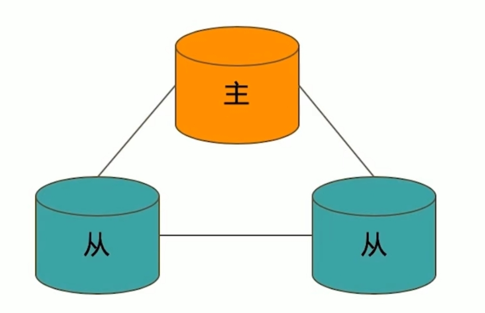
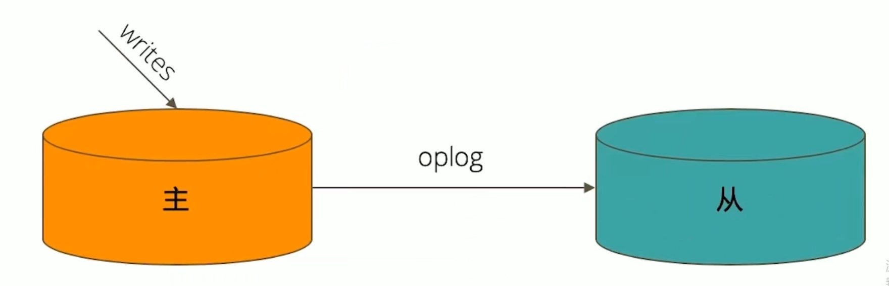

# mongo复制集


---

## 典型复制集结构

一个典型的复制集由3个以上具有投票权的节点组成,包括:

- 一个主节点(PRIMARY):接受写入操作和选举时投票
- 两个(或多个)从节点(SECONDARY): 复制主节点上的新数据和选举时投票
- 不推荐使用Arbiter(投票节点)




## 数据如何复制的

- 当一个修改操作,无论是插入,更新或删除,到达主节点时,它对数据的操作将被记录下来(经过一些必要的转换),这些记录称为oplog.
- 从节点通过在主节点上打开一个tailable游标不断获取新进入主节点的oplog,并在自己的数据上回放,从此保持跟主节点的数据一致.
- 



## 通过选举完成故障恢复

- 具有投票权的节点之间两两互相发送心跳
- 当5次心跳未收到时判断为节点失联
- 如果失联的是主节点,从节点会发生选举,选出新的主节点;
- 如果失联的是从节点则不会产生新的选举
- 选举基于**RAFT一致性算法**实现,选举成功的必要条件是大多数投票节点存活;
- 复制集中最多可以有50个节点,但具有投票权的节点最多7个
- 


```YAML
`这个选举非常重要`
```


## 影响选举的因素

- 整个集群必须有大多数节点存活;
- 被选举为主节点的节点必须:
	- 能够与多数节点建立连接
	- 具有较新的oplog
	- 具有较高的优先级(如果有配置)

## 常见选项

- 复制集节点有以下常见的选配项:
	- 是否具有投票权(v 参数):有则参与投票;
	- 优先级(priority参数): 优先级越高的节点越优先成为主节点.优先级为0的节点无法成为主节点
	- 隐藏(hidden参数): 复制数据,但对应用不可见.隐藏节点可以具有投票权,但优先级必须为0;
	- 延迟(slaveDelay参数): 复制n秒之前的数据,保持与主节点的时间差.
	
	

## 复制集注意事项

- 关于硬件:
	- 因为正常的复制集节点都有可能成为主节点,他们的地位是一样的,因此硬件配置上必须一致;
	- 为了保证节点不会同时宕机,各个节点使用的硬件必须具有独立性.
- 关于软件:
	
	- 复制集节点软件版本必须一致,以避免出现不可预知问题.
- **增加节点不会增加系统写性能!**
	
	
