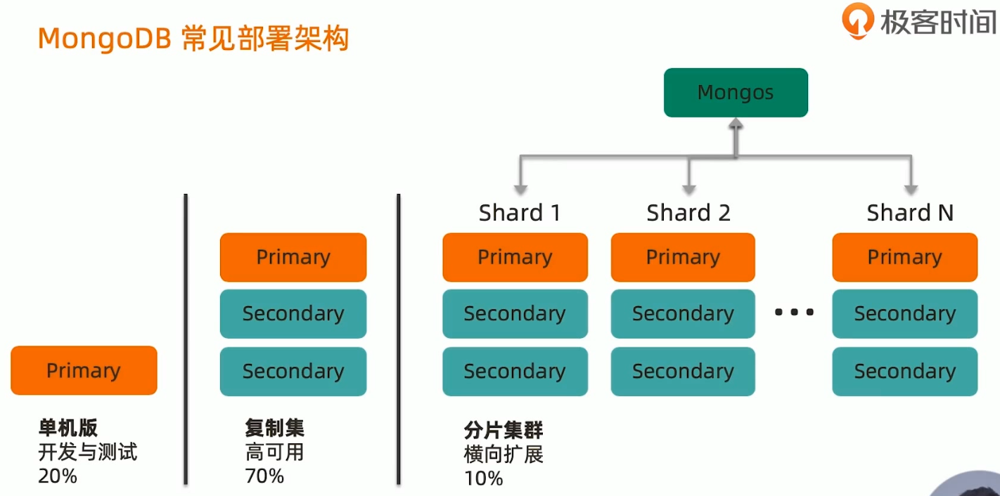
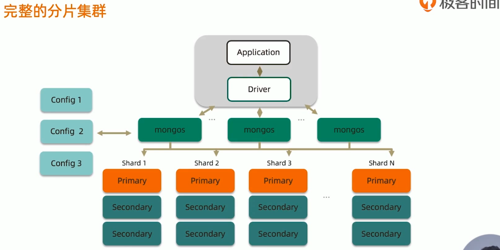
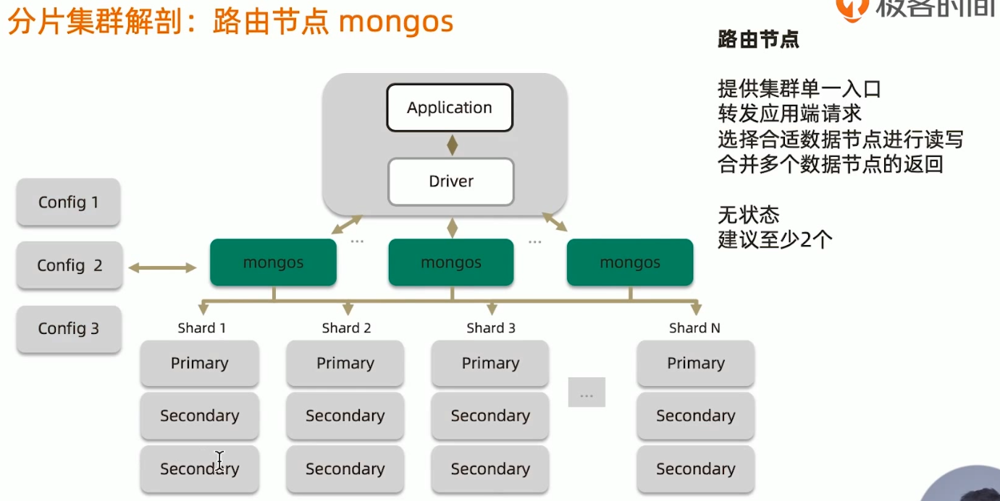
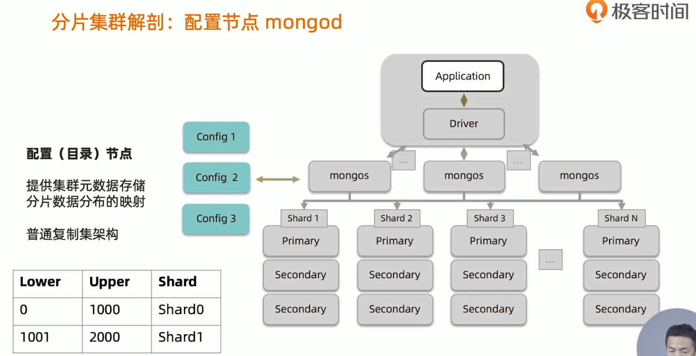
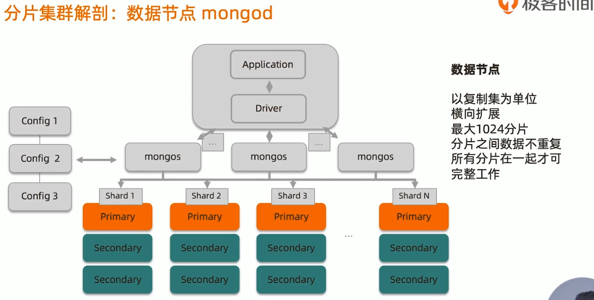
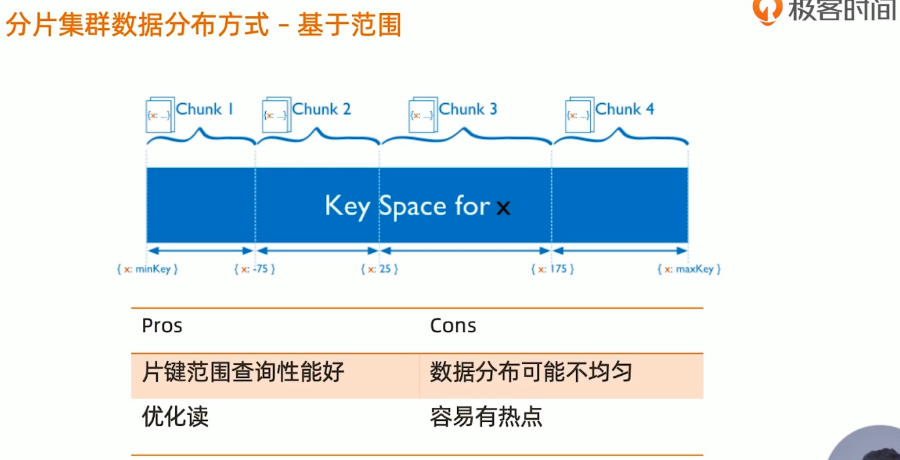
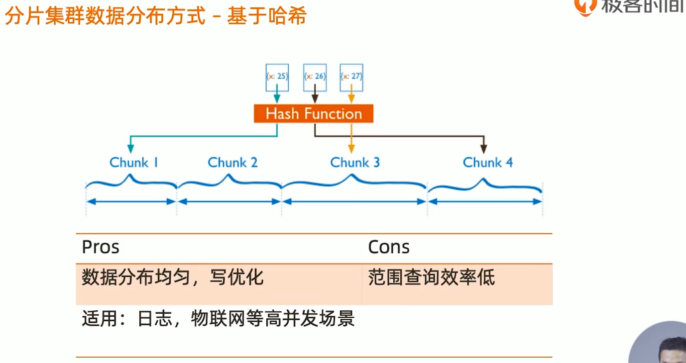
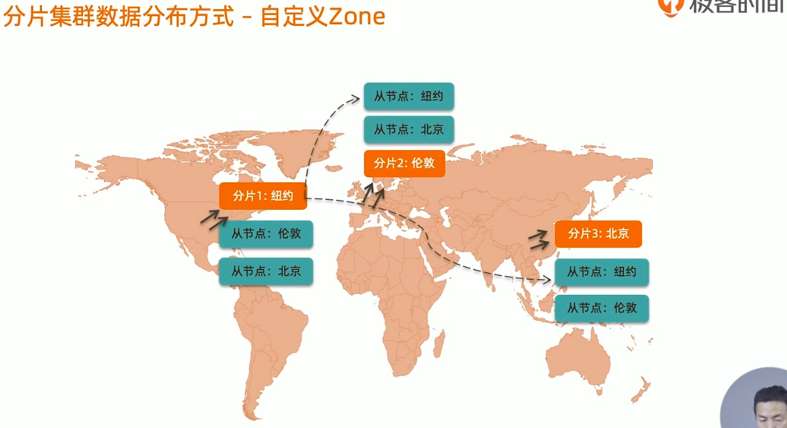

DBA角度&&运维角度

## 为什么要使用分片集群?

- 数据容量日益增大，访问性能日渐降低，怎么破?

- 新品上线异常火爆，如何支撑更多的并发用户?

- 单库已有10TB数据，恢复需要1-2天，如何加速?

- 地理分布数据

  

## MongoDB分片集群特点
- 应用全透明，无特殊处理
- 数据自动均衡
- 动态扩容，无须下线
- 提供三种分片方式

## 分片集群数据分布方式
- 基于范围
- 基于Hash
- 基于zone / tag

## 小结
- 分片集群可以有效解决性能瓶颈及系统扩容问题。
- 分片额外消耗较多，管理复杂，尽量不要分片·
- 如果实在要用，请仔细学习下一讲