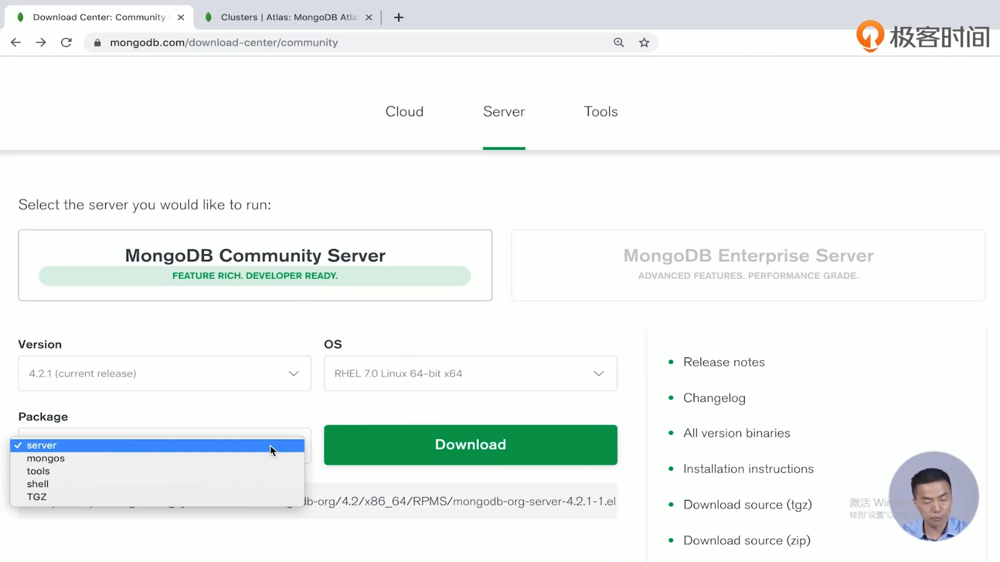

下载

解压


```shell
[root@VM-16-16-centos mongodb-linux-x86_64-rhel70-5.0.6]# pwd
/opt/app/mongodb-linux-x86_64-rhel70-5.0.6
[root@VM-16-16-centos mongodb-linux-x86_64-rhel70-5.0.6]# ls
bin  config  data  LICENSE-Community.txt  log  mongo.log  MPL-2  README  run.sh  THIRD-PARTY-NOTICES
[root@VM-16-16-centos mongodb-linux-x86_64-rhel70-5.0.6]# ls data
db  db1  db2  db3
[root@VM-16-16-centos mongodb-linux-x86_64-rhel70-5.0.6]# ls bin
install_compass  mongo  mongod  mongos
[root@VM-16-16-centos mongodb-linux-x86_64-rhel70-5.0.6]# 
```


方式2

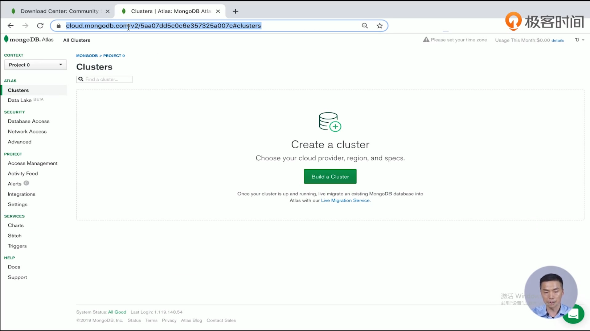

在线使用

cloud.mongodb.com


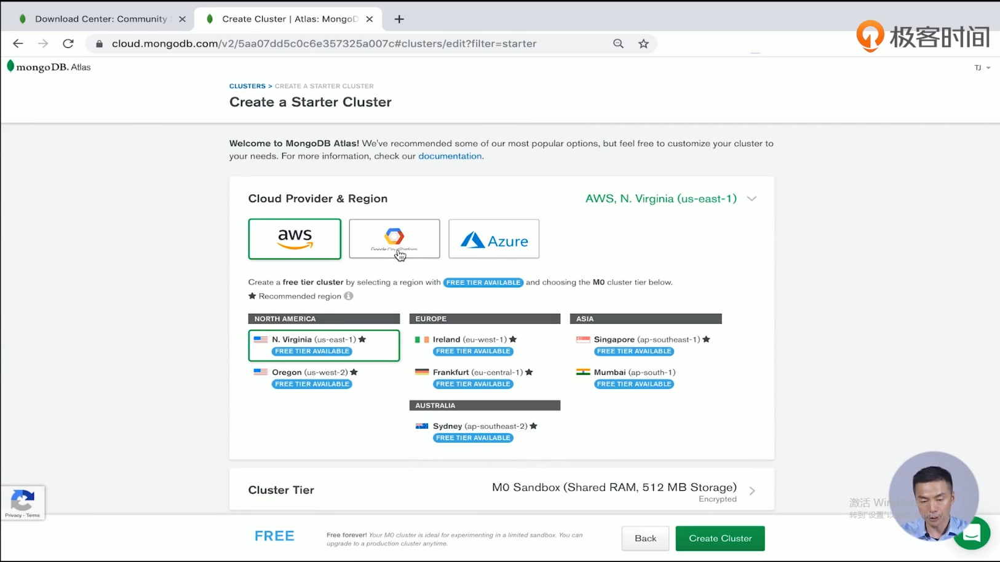

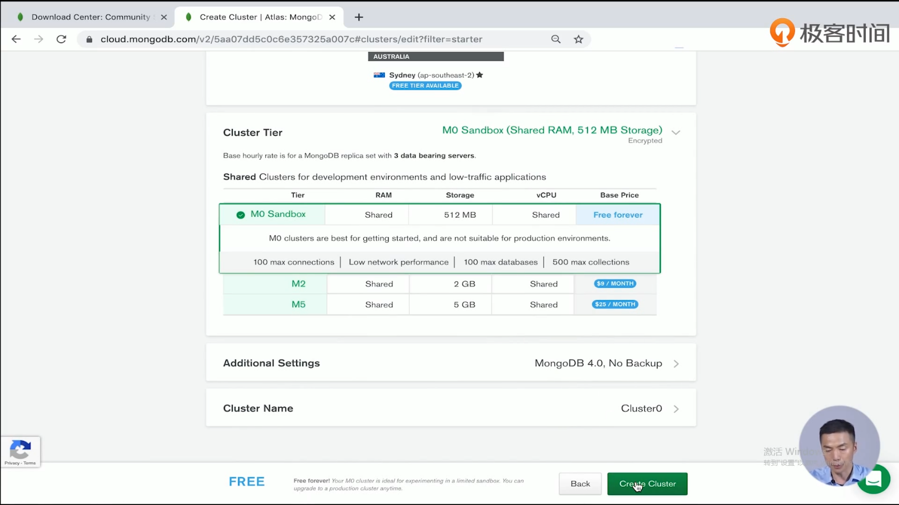

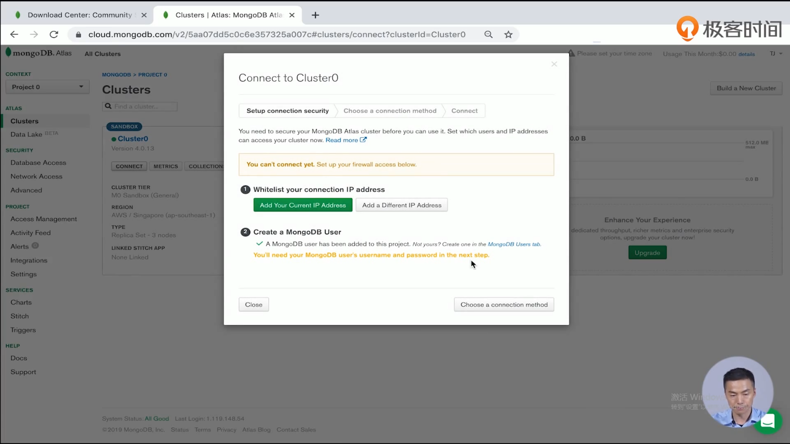

可以连接集群

创建用户

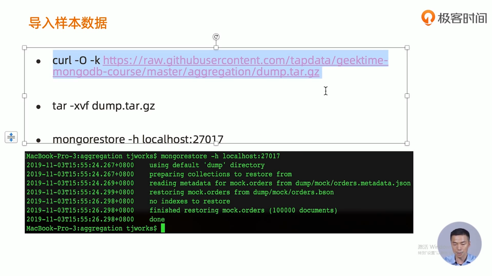

```shell
# 查看数据库
show dbs
# 切换数据库
use mock
#  查看集合
show collections
# 查询
db.user.find()
```

## MongoDb Compass

官方的工具

下载

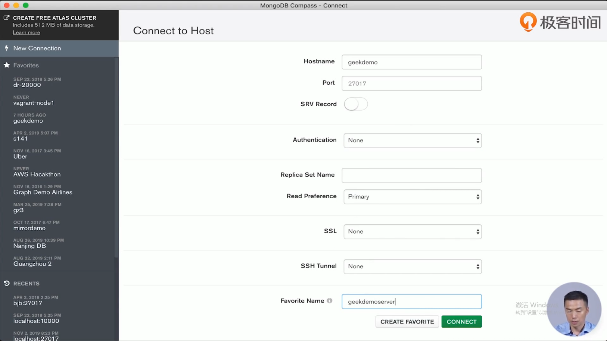

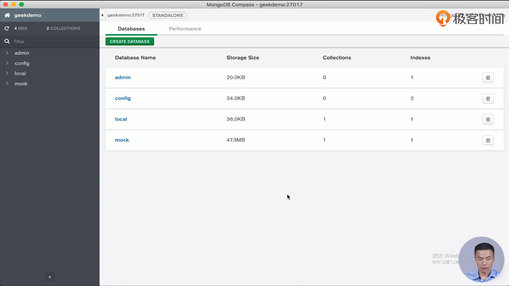

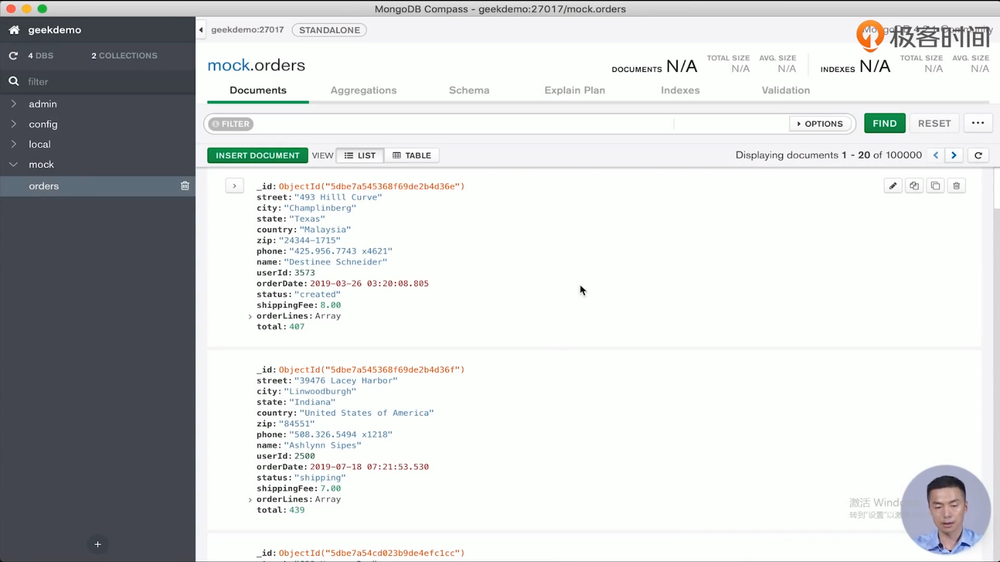

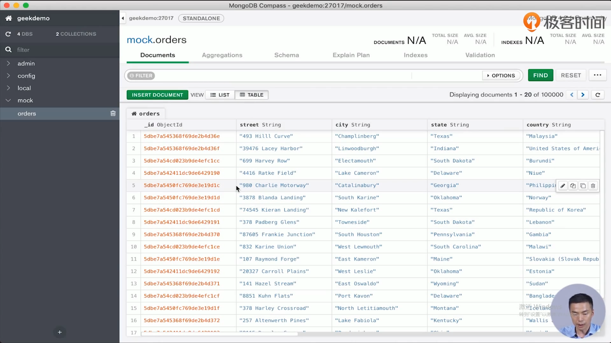

聚合计算

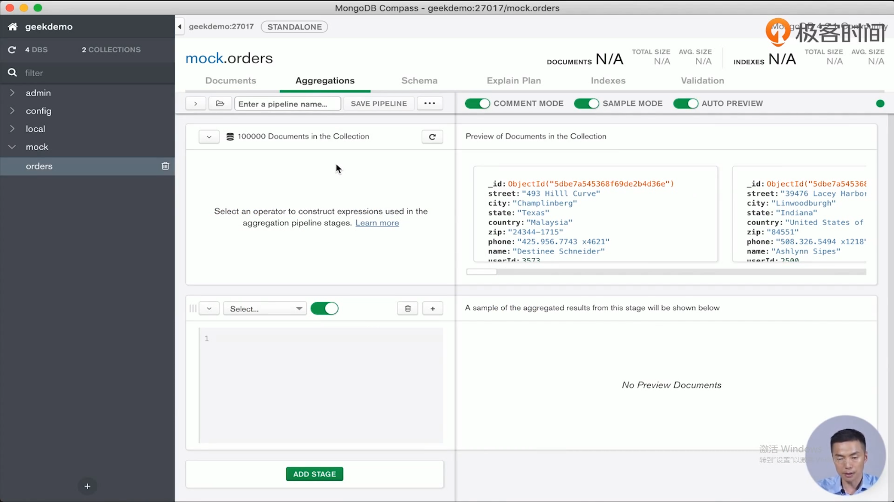

schema分析(这个功能是mongodb compass特有的

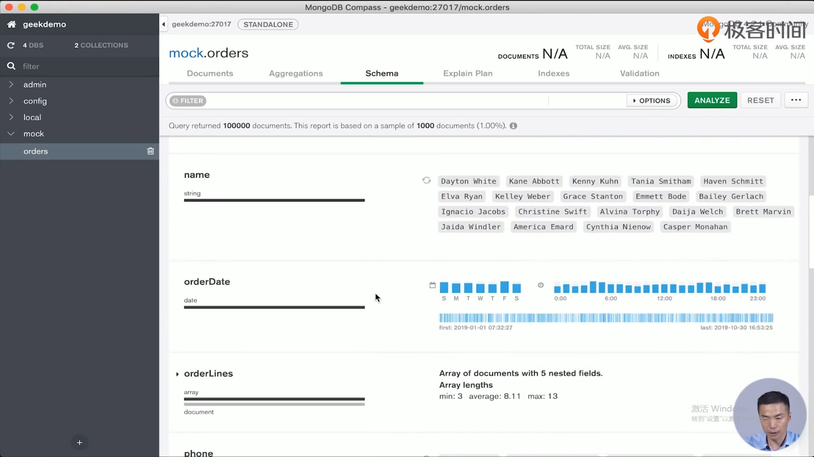

约束

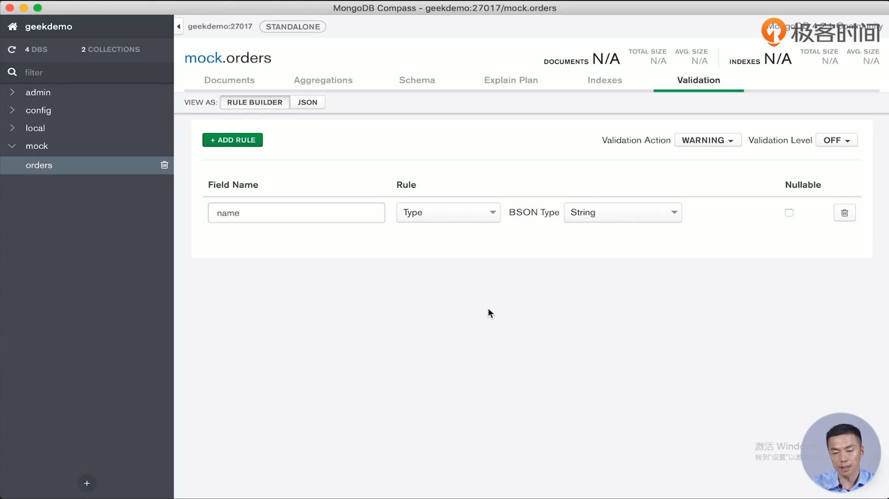