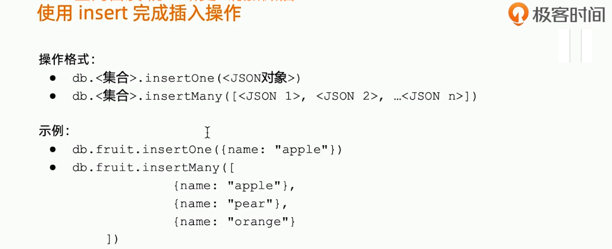

```shell
rs0:PRIMARY> db.fruit.insertOne({name:"apple"})
{
        "acknowledged" : true,
        "insertedId" : ObjectId("6225abbfa7aff08b42d30963")
}
rs0:PRIMARY> db.fruit.find()
{ "_id" : ObjectId("6225abbfa7aff08b42d30963"), "name" : "apple" }
rs0:PRIMARY> 
```

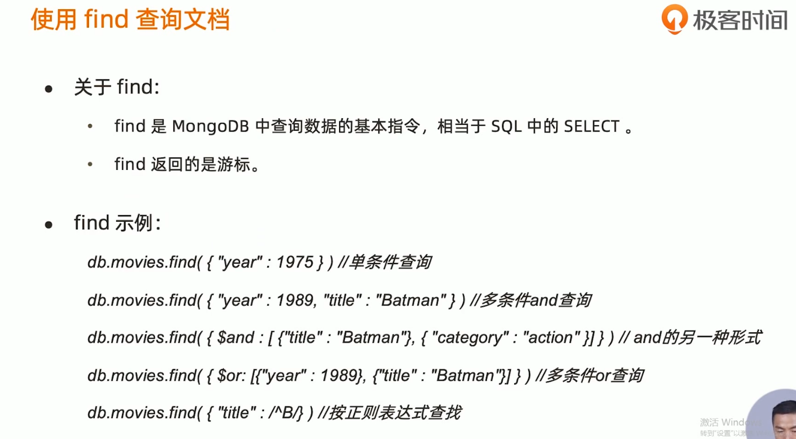

 

where is the different of SQL

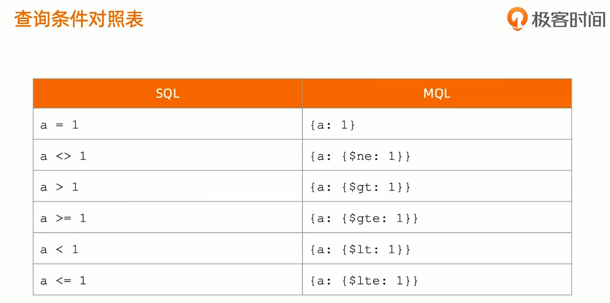

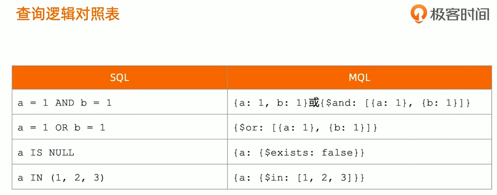


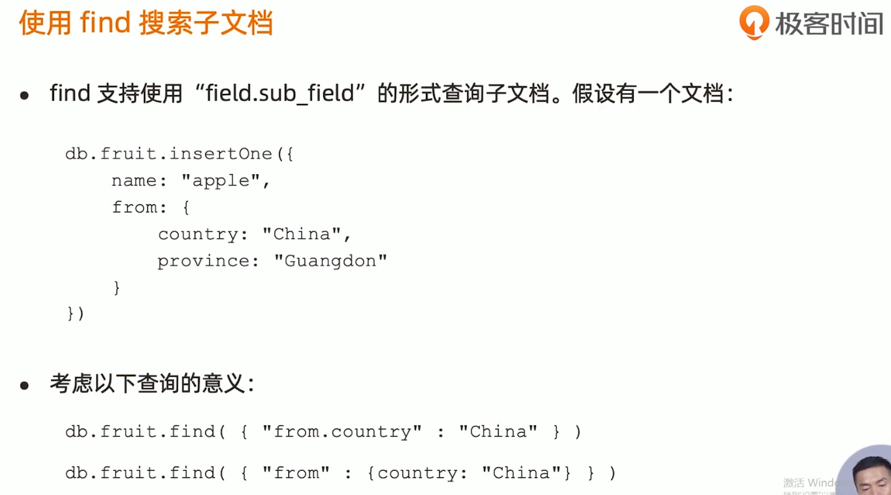

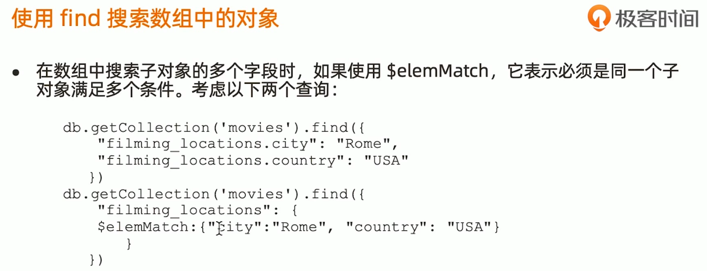

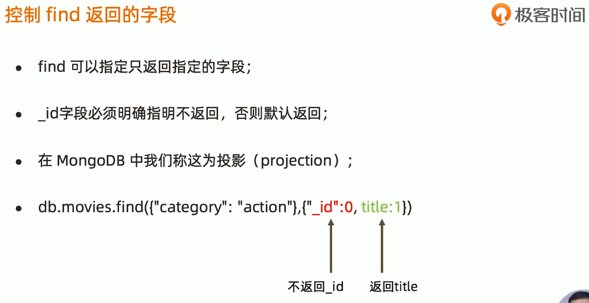

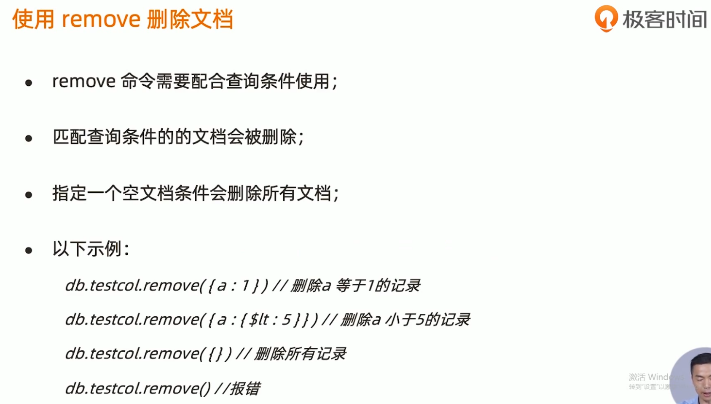

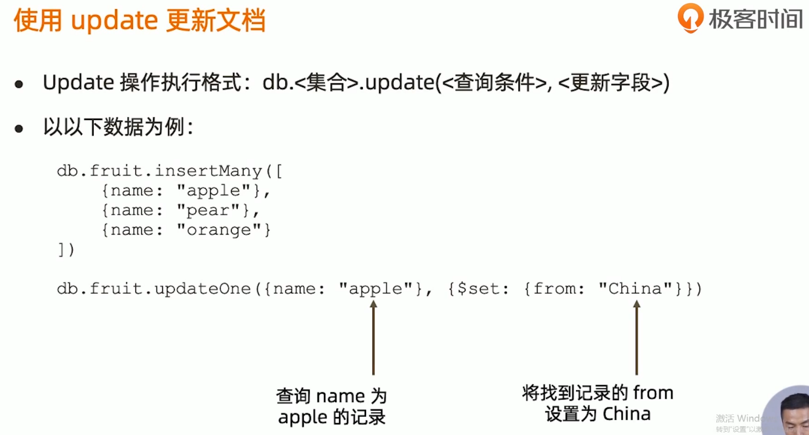

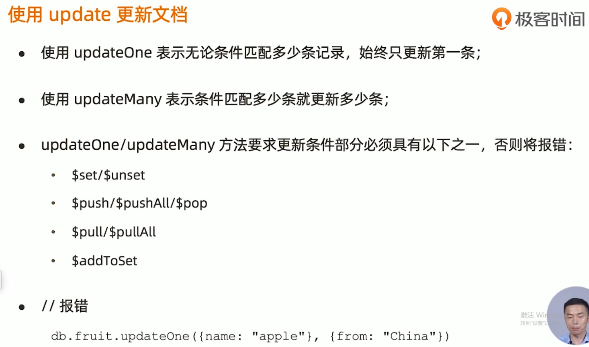


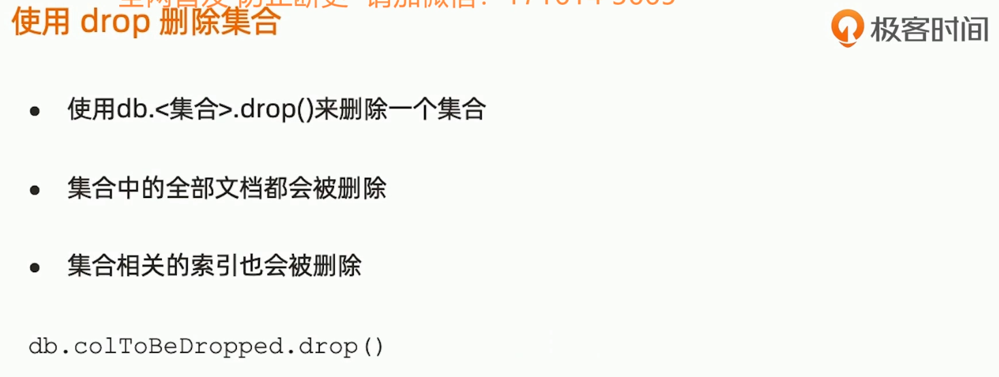

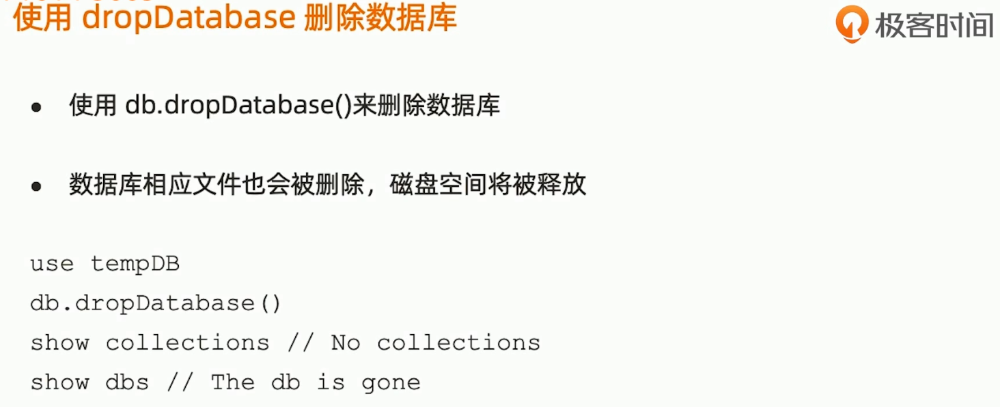