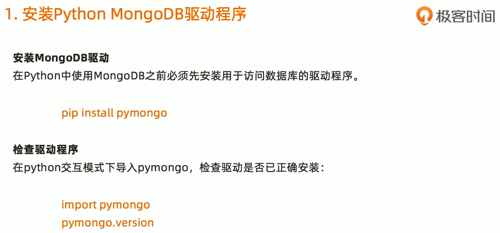
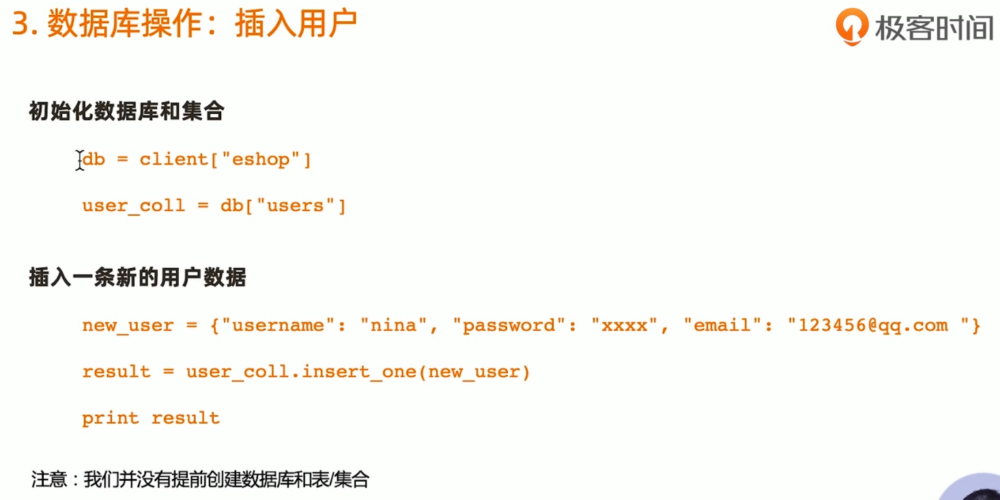
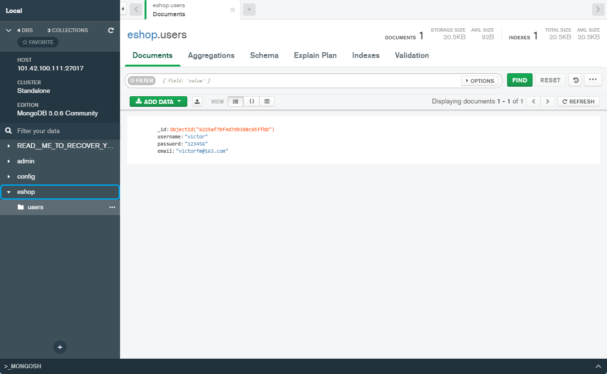
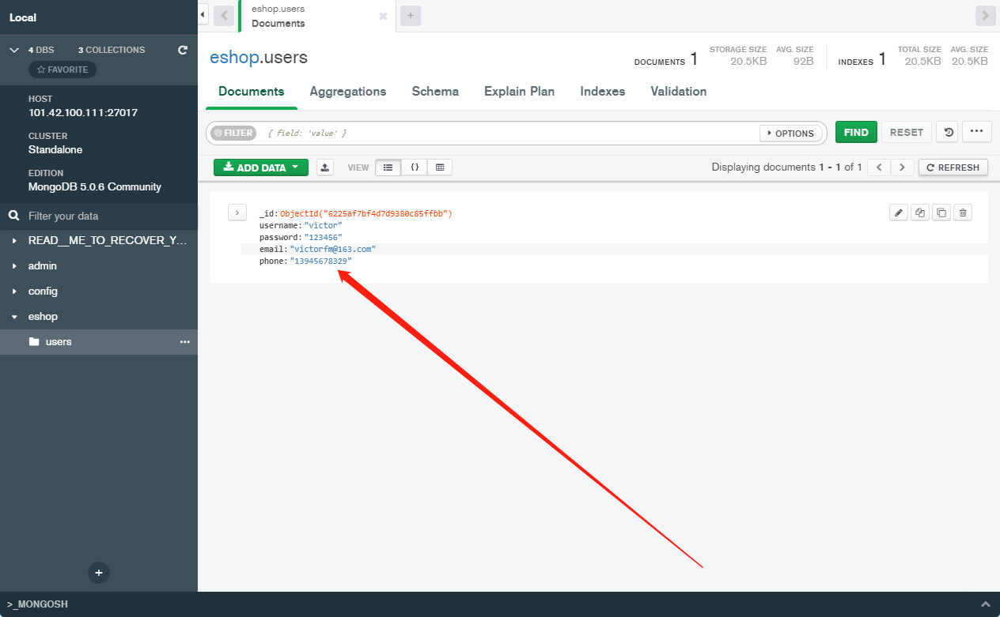

```shell
PS C:\Users\victor> python
Python 3.10.0 (tags/v3.10.0:b494f59, Oct  4 2021, 19:00:18) [MSC v.1929 64 bit (AMD64)] on win32
Type "help", "copyright", "credits" or "license" for more information.
>>> import pymongo
>>> from pymongo import MongoClient
>>> uri = "mongodb:101.42.100.111:27017"
>>> client = MongoClient(uri)     
Traceback (most recent call last):
  File "<stdin>", line 1, in <module>
  File "C:\Python310\lib\site-packages\pymongo\mongo_client.py", line 703, in __init__
    seeds.update(uri_parser.split_hosts(entity, port))
  File "C:\Python310\lib\site-packages\pymongo\uri_parser.py", line 370, in split_hosts
    nodes.append(parse_host(entity, port))
  File "C:\Python310\lib\site-packages\pymongo\uri_parser.py", line 124, in parse_host
    raise ValueError(
ValueError: Reserved characters such as ':' must be escaped according RFC 2396. An IPv6 address literal must be enclosed in '[' and ']' according to RFC 2732.
>>> uri = "mongodb://101.42.100.111:27017" 
>>> client = MongoClient(uri)
>>> print(client)
MongoClient(host=['101.42.100.111:27017'], document_class=dict, tz_aware=False, connect=True)
>>>
```




```shell

>>> db=client["eshop"]
>>> user_coll=db["users"]
>>> new_user = {"username":"victor","password":"123456","email":"victorfm@163.com"}
>>> result = user_coll.insert_one(new_user)
>>> result
<pymongo.results.InsertOneResult object at 0x0000026D0D578E40>
>>>
```





```shell
>>> result = user_coll.update_one({"username":"victor"},{"$set":{"phone":"13945678329"}}) 
>>> result
<pymongo.results.UpdateResult object at 0x0000026D0D6D9A40>
>>>
```



