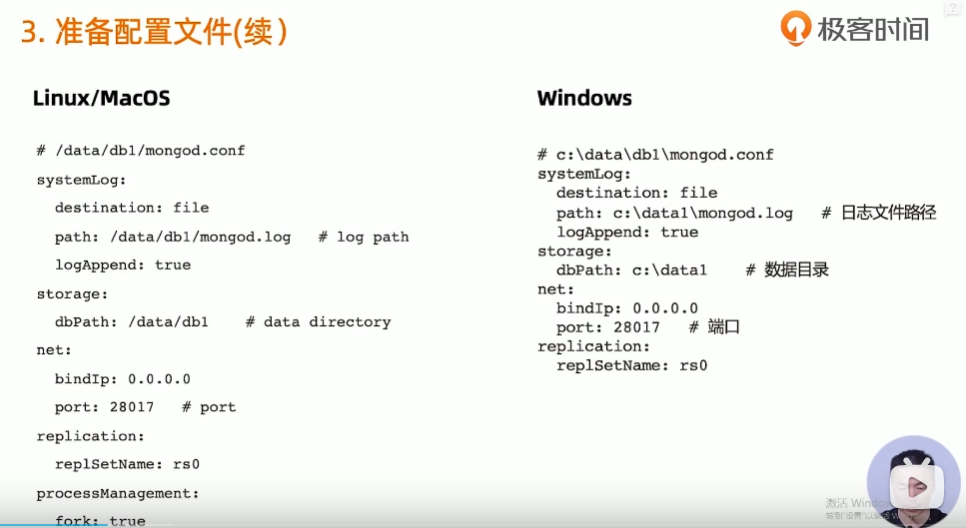
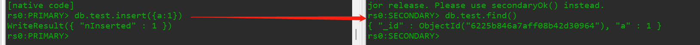

# mongodb集群搭建

### 1. 准备


### 2. 创建数据目录


```Bash
cd /opt/app/mongodb-linux-x86_64-rhel70-5.0.6
mkdir -p data/db{1,2,3}

```


查看

```Bash
[root@VM-16-16-centos mongodb-linux-x86_64-rhel70-5.0.6]# cd data/
[root@VM-16-16-centos data]# ls
db  db1  db2  db3
[root@VM-16-16-centos data]# pwd
/opt/app/mongodb-linux-x86_64-rhel70-5.0.6/data

```


### 3. 准备配置文件





```Bash
[root@VM-16-16-centos db1]# cat mongod.conf
systemLog:
        destination: file
        path: /opt/app/mongodb-linux-x86_64-rhel70-5.0.6/data/db1/mongod.log
        logAppend: true
storage:
        dbPath: /opt/app/mongodb-linux-x86_64-rhel70-5.0.6/data/db1
net:
        bindIp: 0.0.0.0
        port: 28017
replication:
        replSetName: rs0
processManagement
        fork: true
[root@VM-16-16-centos db1]# 
```


### 4. 启动mongodb进程


```Bash
"data/db2/mongod.conf" 13L, 292C written
[root@VM-16-16-centos mongodb-linux-x86_64-rhel70-5.0.6]# 
[root@VM-16-16-centos mongodb-linux-x86_64-rhel70-5.0.6]# ./bin/mongod -f data/db2/mongod.conf 
about to fork child process, waiting until server is ready for connections.
forked process: 13193
child process started successfully, parent exiting
[root@VM-16-16-centos mongodb-linux-x86_64-rhel70-5.0.6]# ./bin/mongod -f data/db3/mongod.conf 
about to fork child process, waiting until server is ready for connections.
forked process: 13266
child process started successfully, parent exiting
[root@VM-16-16-centos mongodb-linux-x86_64-rhel70-5.0.6]# ps -ef|grep mongo
root     11394  4673  0 11:07 pts/0    00:00:00 vi db2/mongod.log
root     11840  4673  0 11:09 pts/0    00:00:00 vi data/db1/mongod.conf
root     12592     1  1 11:12 ?        00:00:01 ./bin/mongod -f data/db1/mongod.conf
root     13193     1  4 11:14 ?        00:00:00 ./bin/mongod -f data/db2/mongod.conf
root     13266     1  8 11:14 ?        00:00:00 ./bin/mongod -f data/db3/mongod.conf
root     13353  4673  0 11:14 pts/0    00:00:00 grep --color=auto mongo
root     29502     1  0 Mar03 ?        00:18:24 ./bin/mongod -f ./config/mongod.conf
[root@VM-16-16-centos mongodb-linux-x86_64-rhel70-5.0.6]# 
```


```Bash
[root@VM-16-16-centos mongodb-linux-x86_64-rhel70-5.0.6]# cat data/db2/mongod.conf 
systemLog:
  destination: file
  path: /opt/app/mongodb-linux-x86_64-rhel70-5.0.6/data/db2/mongod.log
  logAppend: true
storage:
  dbPath: /opt/app/mongodb-linux-x86_64-rhel70-5.0.6/data/db2
net:
  bindIp: 0.0.0.0
  port: 28018
replication:
  replSetName: rs0
processManagement:
  fork: true
[root@VM-16-16-centos mongodb-linux-x86_64-rhel70-5.0.6]# 
```


### 5. 配置复制集


```Bash
[root@VM-16-16-centos mongodb-linux-x86_64-rhel70-5.0.6]# hostname -f
VM-16-16-centos
[root@VM-16-16-centos mongodb-linux-x86_64-rhel70-5.0.6]# 
```


```Bash
rs0:PRIMARY> rs.status()
{
        "set" : "rs0",
        "date" : ISODate("2022-03-07T05:07:56.558Z"),
        "myState" : 1,
        "term" : NumberLong(1),
        "syncSourceHost" : "",
        "syncSourceId" : -1,
        "heartbeatIntervalMillis" : NumberLong(2000),
        "majorityVoteCount" : 1,
        "writeMajorityCount" : 1,
        "votingMembersCount" : 1,
        "writableVotingMembersCount" : 1,
        "optimes" : {
                "lastCommittedOpTime" : {
                        "ts" : Timestamp(1646629671, 1),
                        "t" : NumberLong(1)
                },
                "lastCommittedWallTime" : ISODate("2022-03-07T05:07:51.664Z"),
                "readConcernMajorityOpTime" : {
                        "ts" : Timestamp(1646629671, 1),
                        "t" : NumberLong(1)
                },
                "appliedOpTime" : {
                        "ts" : Timestamp(1646629671, 1),
                        "t" : NumberLong(1)
                },
                "durableOpTime" : {
                        "ts" : Timestamp(1646629671, 1),
                        "t" : NumberLong(1)
                },
                "lastAppliedWallTime" : ISODate("2022-03-07T05:07:51.664Z"),
                "lastDurableWallTime" : ISODate("2022-03-07T05:07:51.664Z")
        },
        "lastStableRecoveryTimestamp" : Timestamp(1646629633, 1),
        "electionCandidateMetrics" : {
                "lastElectionReason" : "electionTimeout",
                "lastElectionDate" : ISODate("2022-03-07T03:25:11.410Z"),
                "electionTerm" : NumberLong(1),
                "lastCommittedOpTimeAtElection" : {
                        "ts" : Timestamp(1646623511, 1),
                        "t" : NumberLong(-1)
                },
                "lastSeenOpTimeAtElection" : {
                        "ts" : Timestamp(1646623511, 1),
                        "t" : NumberLong(-1)
                },
                "numVotesNeeded" : 1,
                "priorityAtElection" : 1,
                "electionTimeoutMillis" : NumberLong(10000),
                "newTermStartDate" : ISODate("2022-03-07T03:25:11.451Z"),
                "wMajorityWriteAvailabilityDate" : ISODate("2022-03-07T03:25:11.474Z")
        },
        "members" : [
                {
                        "_id" : 0,
                        "name" : "VM-16-16-centos:28017",
                        "health" : 1,
                        "state" : 1,
                        "stateStr" : "PRIMARY",
                        "uptime" : 6944,
                        "optime" : {
                                "ts" : Timestamp(1646629671, 1),
                                "t" : NumberLong(1)
                        },
                        "optimeDate" : ISODate("2022-03-07T05:07:51Z"),
                        "lastAppliedWallTime" : ISODate("2022-03-07T05:07:51.664Z"),
                        "lastDurableWallTime" : ISODate("2022-03-07T05:07:51.664Z"),
                        "syncSourceHost" : "",
                        "syncSourceId" : -1,
                        "infoMessage" : "",
                        "electionTime" : Timestamp(1646623511, 2),
                        "electionDate" : ISODate("2022-03-07T03:25:11Z"),
                        "configVersion" : 1,
                        "configTerm" : 1,
                        "self" : true,
                        "lastHeartbeatMessage" : ""
                }
        ],
        "ok" : 1,
        "$clusterTime" : {
                "clusterTime" : Timestamp(1646629671, 1),
                "signature" : {
                        "hash" : BinData(0,"AAAAAAAAAAAAAAAAAAAAAAAAAAA="),
                        "keyId" : NumberLong(0)
                }
        },
        "operationTime" : Timestamp(1646629671, 1)
}
rs0:PRIMARY> 
```


>members表示数组,是可以单节点支持的,

加入其他节点

```Bash
rs0:PRIMARY> rs.add("VM-16-16-centos:28018")
{
        "ok" : 1,
        "$clusterTime" : {
                "clusterTime" : Timestamp(1646629839, 1),
                "signature" : {
                        "hash" : BinData(0,"AAAAAAAAAAAAAAAAAAAAAAAAAAA="),
                        "keyId" : NumberLong(0)
                }
        },
        "operationTime" : Timestamp(1646629839, 1)
}
rs0:PRIMARY> rs.add("VM-16-16-centos:28019")
{
        "ok" : 1,
        "$clusterTime" : {
                "clusterTime" : Timestamp(1646629846, 1),
                "signature" : {
                        "hash" : BinData(0,"AAAAAAAAAAAAAAAAAAAAAAAAAAA="),
                        "keyId" : NumberLong(0)
                }
        },
        "operationTime" : Timestamp(1646629846, 1)
}
rs0:PRIMARY> 
```


再看状态

```Bash

```

---

连接从节点

```shell
rs0:SECONDARY> rs.slaveOk()
# 允许从节点读~

```

