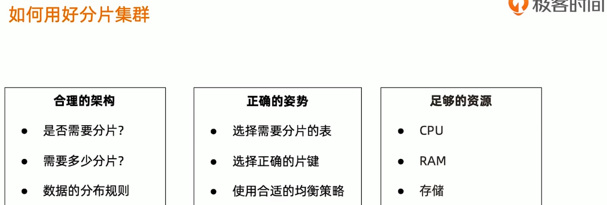
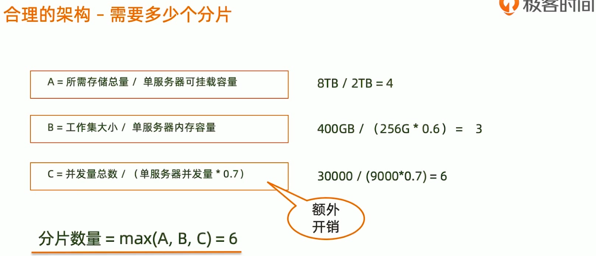
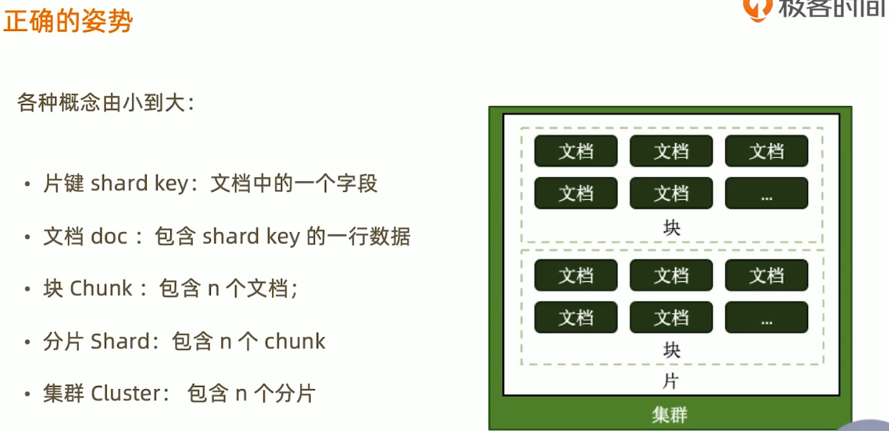
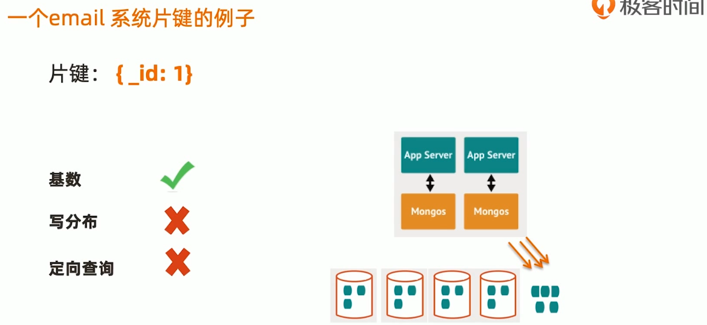
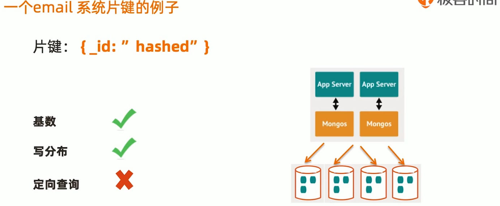

## 合理的架构–分片大小

分片的基本标准:

- 关于数据:数据量不超过3TB，尽可能保持在2TB一个片;

- 关于索引:常用**索引**必须容纳进**内存**;

  

  按照以上标准初步确定分片后，还需要考虑业务压力，随着压力增大，CPU、RAM、磁盘中的任何一项出现瓶颈时，都可以通过添加更多分片来解决。

## 合理的架构–其他需求
考虑分片的分布:

- 是否需要跨机房分布分片?
- 。是否需要容灾?
- 。高可用的要求如何?

## 正确的姿势–定向性好

考虑:
4个分片的集群，你希望读某条特定的数据
如果你用片键作为条件查询，mongos可以直接定位到具体的分片如果你不用片键，mongos需要把查询发到4个分片

- 等最后的一个分片响应，mongos才能响应应用端。

  结论:对主要查询要具有定向能力

 

## 足够的资源
即使项目初期已经具备了足够的资源，仍然需要考虑在合适的时候扩展。
建议监控各项资源使用情况，无论哪一项达到60%以上，则开始考虑扩展，

因为:。

- 扩展需要新的资源，申请新资源需要时间;
- 。扩展后数据需要均衡，均衡需要时间。应保证新数据入库速度慢于均衡速度
- 。均衡需要资源，如果资源即将或已经耗尽，均衡也是会很低效的。